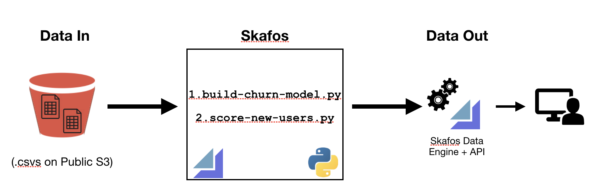

# Predictive Modeling Using Skafos
**DEPRECATION WARNING**

This code example was intended for use by the legacy Skafos platform and is no longer being maintained. On 05/29/2019, a new version of [Skafos](https://skafos.ai) was released, streamlining model delivery to the edge. 

[Sign-up](https://dashboard.skafos.ai/sign-up) for an account, [join](https://join.slack.com/t/metismachine-skafos/shared_invite/enQtNTAxMzEwOTk2NzA5LThjMmMyY2JkNTkwNDQ1YjgyYjFiY2MyMjRkMzYyM2E4MjUxNTJmYmQyODVhZWM2MjQwMjE5ZGM1Y2YwN2M5ODI) our Slack community, and explore some [example models](https://github.com/skafos/colab-example-models) to get started.

---


## Introduction

The purpose of this example is to highlight the utility of Skafos, Metis Machine's data science operationalization and delivery platform. In this example, we will: 

* Build and train a model predicting cell phone [churn](http://www.businessdictionary.com/definition/churn.html) with data that is available on a public S3 bucket. 
* Save this model using the Skafos data engine
* Score new customers using this model and save these scores.
* Access these scores via an API or the data engine. 

Note: This tutorial walks you through the standard data science workflow in Skafos. To work through the iOS Quickstart process, go to [QuickStart for iOS Developers](https://docs.metismachine.io/docs/ios-getting-started)

## Functional Architecture + Code

The figure below provides a functional architecture for this process.



## Pre-requisites

1. [Sign up](https://dashboard.metismachine.io/sign-up) for a Skafos account. _If you do not have a Skafos account, you will not be able to complete this tutorial._ 
2. Go through the [Skafos Quickstart for Datascientists tutorial](https://docs.metismachine.io/docs/installation-cli) to set-up your account. This will take 1-2 minutes. 
3. [Install skafos on your machine](https://docs.metismachine.io/docs/installation)
4. Authenticate your account via the `skafos auth` command.
5. A working knowledge of how to use git. 

## Input Data

The source data for this example is available in a public S3 bucket provided by Metis Machine. _In the steps below, we will describe how to access it. No code modifications are required to access the input data._

This data has been slightly modified from its source, which is freely available and can be found [here](https://www.ibm.com/communities/analytics/watson-analytics-blog/predictive-insights-in-the-telco-customer-churn-data-set/) or [here](https://www.kaggle.com/blastchar/telco-customer-churn/home). 

## Tutorial

In the following step-by-step guide, we will walk you through how to use the code in this repository to run a job on Skafos. Following completion of this tutorial, you should be able to: 

1. Run the existing code and access its output using the Skafos Data Engine.
2. Replace the provided data and model with your own data and model. 

### Step 1: Fork the repo 

1. [Fork](https://help.github.com/articles/fork-a-repo/) the [churn-model-demo](https://github.com/skafos/churn-model-demo) from Github. This code is freely available as part of the Skafos organization. Note that the README is a copy of these instructions. 
2. Clone the forked repo to your machine, and add an upstream remote to connect to the original repo, if desired.

### Step 2: Initialize your own Skafos project 

Once in top level of the working directory of this project, type: `skafos init` on the command line. This will generate a new `metis.config.yml` file that is tied to your Skafos account and organization. It will look like the `metis.config.yml.example` file included in this repo. 

### Step 3: Edit the `metis.config.yml` file

Open up this config file and edit the job name and entrypoint to match `metis.config.yml.example` included in the repo. Specifically, the name and entrypoint should look like this: 

``` yaml
name: build-churn-model 
entrypoint: "build-churn-model.py"
```

**Note: Do _not_ edit the project token or job_ids in the .yml file. Otherwise, Skafos will not recognize and run your job.** 

### Step 4: Add a second job to your Skafos project and `metis.config.yml`

In `metis.config.yml.example`, you'll note that there are two jobs: one to build a model, and one to score new users. You will need to add a second job to your Skafos project via the following command on the command line: 

`skafos create job score-new-users`

This will output a job_id on the command line. Copy this job id to your `metis.config.yml` file, again using `metis.config.yml.example` as a template, and including the following:

``` yaml
language: python 
name: score-new-users
entrypoint: "score-new-users.py"
dependencies: ["<job-id for build-churn-model.py>"]
```

This dependency will ensure that new users are not scored until the churn model has been built. If `build-churn-model.py` does not complete, then `score-new-users.py` will not run. Note the quotations that are necessary around the job id on the dependencies line.  

### Step 5: Add `metis.config.yml` to your repo

Now that your `metis.config.yml` file has all the necessary components, add it to the repo, commit, and push.  

### Step 6: Add Skafos to the Github repo
In Steps 3 and 4 above, you initialized a Skafos project so you can run the cloned repo in Skafos. Now, you will need to [add the Skafos app](https://github.com/apps/skafos) to your Github repository. 

To do this, navigate to the Settings page for your organization, click on _Installed GitHub Apps_ to add the Skafos app to this repository. Alternatively, if this repo is not part of an organization, navigate to your _Settings_ page, click on _Applications_, and install the Skafos app. 

### Step 7: Make a small code change, commit and push.

In order for Skafos to run your job, you will need to make a change to your code. It can be as simple as a sentence to this `README.md` or adding a comment in one of the Python files. Once these changes are pushed to github, the Skafos app will pick them up and run both the training and scoring jobs. 

### Step 8: Monitor your jobs

Navigate to [dashboard.metismachine.io](https://dashboard.metismachine.io/) to monitor the status of the job you just pushed. Additional documentation about how to use the dashboard can be found [here](https://docs.metismachine.io/docs/dashboard).

### Step 9: Verify model and metrics upon job completion

Once your job has completed, you can verify that the predictive model itself (in the form of a `.pkl` file) was written to Cassandra. This can be viewed in the job logs in the dashboard. 

### Step 10: Access scores via API

In addition to data that has been output to S3, this code uses the [Skafos SDK](https://docs.metismachine.io/docs/skafos-sdk) to store scored users in a [Cassandra](https://docs.metismachine.io/docs/skafos-sdk#section-using-cassandra) database. Specifically, the `save_scores` function, will write scored users to a table. 

The scored users in Cassandra can be easily accessed via an API call. Navigating to the root project directory on the command line, type `skafos fetch --table model_scores`. This will return both a list of scores and a cURL command that can be incorporated into applications in the usual fashion to retrieve this data. 

## Next Steps

Now that you have successfully built a predictive model on Skafos and scored new data, you can adapt this code to build your own models. An example `build-churn-model.ipynb` has been added to the code repository for this example as a starting point for experimentation and testing. 


 


